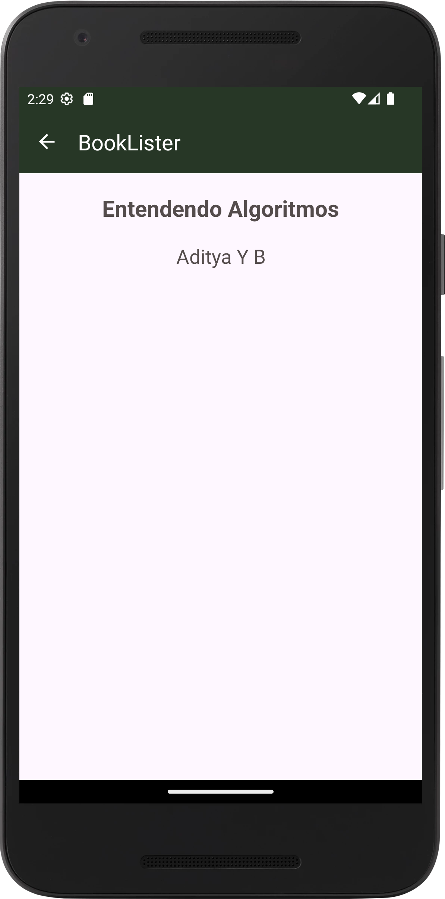
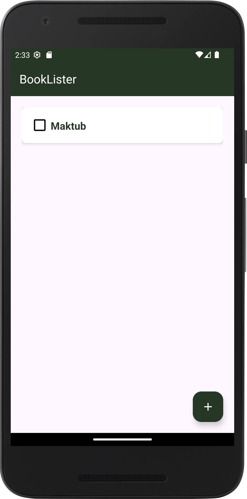

# Book Lister

Book Lister é um aplicativo desenvolvido para facilitar o gerenciamento da sua lista de livros. Com ele, você pode adicionar, visualizar e organizar seus livros de maneira prática e intuitiva.

## :camera_flash: Screenshots
<!-- You can add more screenshots here if you like -->
     
    

## Funcionalidades
* Splash Screen: Tela inicial de carregamento do aplicativo com uma imagem personalizada.
* Adicionar Livros: Permite ao usuário adicionar novos livros à sua lista, incluindo título e autor.
* Visualizar Livros: Exibe uma lista dos livros adicionados, onde o usuário pode visualizar o título e o autor.
* Remover Livros: O usuário pode remover livros da lista ao marcar a caixa de seleção correspondente.
* Navegação Intuitiva: Uso de uma Toolbar com navegação facilitada entre as telas.

## Tecnologias
* Kotlin 
* Activity para gerenciamento de telas
* ViewGroup
    - ConstraintLayout
* Componentes de UI
    - TextView
    - EditText
    - Button
    - RecyclerView
* Intents para navegação entre telas
* Toast para exibição de mensagens
* View Binding para simplificação de interações com a UI

### TODO
- Adicionar sistema de login: Permitir que os usuários façam login no aplicativo para personalizar seu perfil, incluindo foto, descrição e salvar suas preferências.
- Implementar status de leitura dos livros: Adicionar a opção de marcar os livros como "não iniciado", "iniciado", "finalizado" ou "interrompido".
- Possibilitar a edição das informações de um livro já adicionado: Permitir que o usuário edite o título, autor, e outros detalhes de um livro que já foi adicionado.
- Melhorar o layout com animações e design mais moderno.
- Implementar modo escuro: Adicionar um modo escuro para melhorar a usabilidade em ambientes com pouca luz.

## Author
Lethycia Sabrina Leal Santos (follow me on [Linkedin](https://www.linkedin.com/in/lethyciasabrinaleal/))
